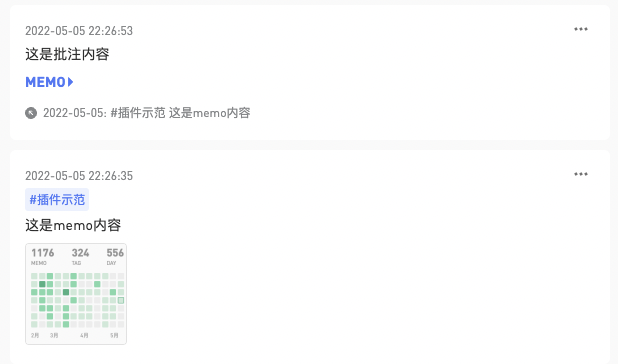

# Logseq Flomo Plugin

✨ 同步 flomo 笔记至 logseq。

> **🚦 重要提示**：
> 为防止同步出错可能会导致数据丢失的问题，建议提前备份 logseq 库。或使用一个全新的库来测试，确认无误后再在正式库中使用。

## 🔨 使用准备

因为 flomo 暂未开放 Api，目前只能通过 http-proxy 的方法来获取 flomo 中的数据。请下载此项目（[flomo-proxy-server](https://github.com/swiftwind0405/flomo-proxy-server/releases)），运行起来后方可继续使用本插件。本工具不记录任何用户信息，只在本地服务器运行处理。
用于数据请求的授权信息字段， 请参照下面[常见问题](#-常见问题)中的[问题1](#1-%E5%A6%82%E4%BD%95%E8%8E%B7%E5%8F%96%E6%8E%88%E6%9D%83%E4%BF%A1%E6%81%AF)获取。
## ⚙️ 规则说明
1.  标签模式：每一个 tag 作为独立的 page
2.  日记模式：指定时间范围内，把 memos 写入相应的 journal note 中
3.  单页模式：所有的 memos 放一个 page 中
                
- 仅导出数据：仅导出 flomo 笔记，不带有 logseq 块属性，无法持续更新，用其他 markdown 工具打开无块属性污染，适用于备份数据。
## 📦 同步说明

1. 如果 memo 附有图片，会同步在第一个子节点，方便折叠，否则图片占据页面空间过多。
2. 批注也作为子节点同步，只会同步在被批注的节点下，不会作为一级内容同步，避免重复同步。
3. 如果同步过的内容在 flomo 里修改了内容，再次使用插件同步后，logseq 里的内容会更新（仅导出模式不会更新）。
4. flomo 里删除的内容，在 logseq 里不会因为同步而删除。

## 💡 常见问题

### 1. 如何获取授权信息

1. 在你的浏览器登陆 flomo 账号后，按 F12 打开浏览器控制台后再次刷新 flomo 的页面（强调：需要先调出控制台再刷新，字段肯定有的）
2. 找到列表中为 tz=8:0 的接口，复制里面的 userId、cookie、x-xsrf-token 到 logseq 插件的弹窗

### 2. 每次更新需手动在插件内操作同步，不支持自动更新
